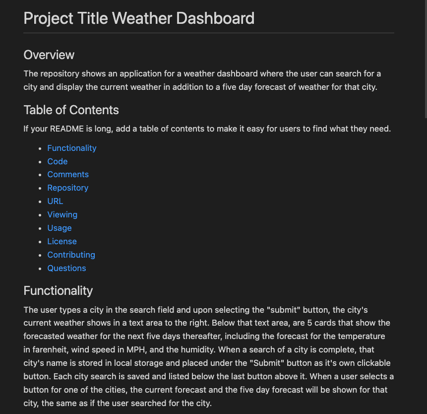
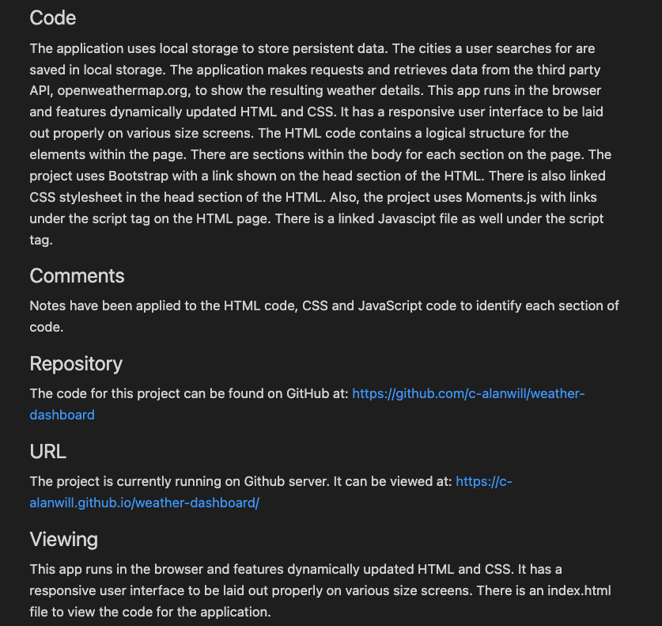
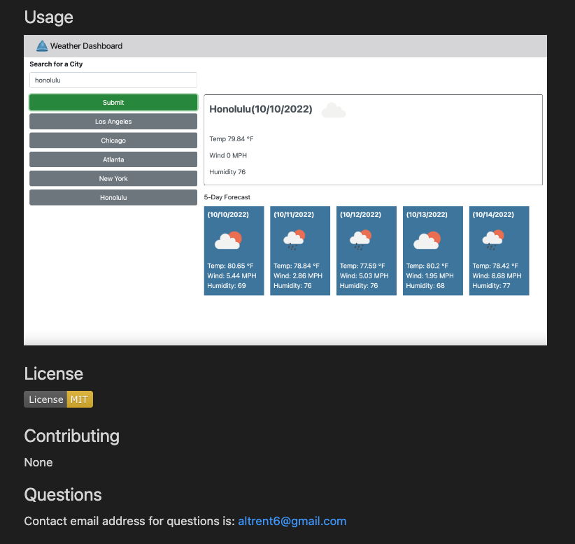

# README Generator

## Description

* The repository shows an application where a user can create a professional README.md file for an project.  The command-line application will dynamically generate the README.md file from a user's input using the [Inquirer package](https://www.npmjs.com/package/inquirer/v/8.2.4) for Node.js.   

## Functionality 

* From the command line, the user is prompted for information that will make up the sections of README.md file for their project.  The user is asked questions relating to their project, such as: the project's title; a description of the project; how to install the project; the license they wish to use; if there are any contributers, and more.  A Table of Contents is included where if the user selects one of the links in the Table of Contents the page will advance to that section of the README. 

* The application will be invoked by using the following command in the terminal:
node index.js

## Code

* There is an index.js file that lays out the code from which the README file is generated.  

* Included is a package.json file with the required dependencies, as well as gitignore, node_modules and .DS_Store files.

## Comments

* Comments have been applied to the index.js file to identify each section of code. 

## Installation

* The code for this project can be found on GitHub at: https://github.com/c-alanwill/readme-generator

* A link to a video that shows a walkthrough demonstrating how this readme works is available at: https://drive.google.com/file/d/1_SL-QjndJmhXs-31FF--Iq-uZfIbYT11/view?usp=sharing

## Usage

The following 3 images demonstrate a sample of a README.md appearance for a Weather Dashboard Application that was generated using this code that allows me to generate a README.md file.

## Credits

N/A

## License

Please refer to the license in the repository.

## Contributing

N/A